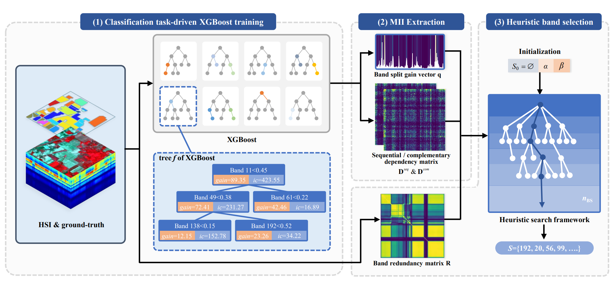

# 🌳 XGBS
> An advanced supervised hyperspectral band selection method

[](https://opensource.org/licenses/MIT)

## ⭐ Article
[Classification Task-Driven Hyperspectral Band Selection via Interpretability from XGBoost](https://ieeexplore.ieee.org/document/11008687)

*Abstract*
> Band selection (BS) identifies key bands from hyperspectral imagery (HSI) for specific downstream tasks, playing a pivotal role in practical applications. eXtreme Gradient Boosting (XGBoost), an interpretable tree-based ensemble learning classifier, explicitly implements the complex nonlinear hyperspectral classification. The interpretable information extracted from tree structure offers a novel basis for supervised BS. To this end, this paper proposes a supervised BS method, named classification task-driven hyperspectral band selection via interpretability from XGBoost (XGBS). It leverages prior knowledge to train a classification task-driven XGBoost, and interprets tree structure to extract multivariate interpretable information, encompassing band split gain and two types of band dependencies. Subsequently, a heuristic search framework is employed to evaluate band performance, facilitating the selection of bands with strong classification capability, high interdependency and low redundancy. Experiments conducted on six real HSI datasets demonstrate the effectiveness and stability of the proposed XGBS.

*Overall structure of XGBS*


## 📦️ Installation
> XGBS has only been tested on Python==3.9.18.
> Other Python versions should be able to run, please try to use Python>=3.9.

```
pip install xgbs
```
*Or you can run XGBS directly from the source code*:
```
git clone https://github.com/FunctionMayBeStatic/XGBS.git
cd XGBS
pip install numpy>=2.0.2
pip install XGBoost>=2.1.1
python demo.py
```
## 🧩 Demo

```
import scipy
import xgbs

hsi = scipy.io.loadmat('Indian_pines.mat')['indian_pines']
gt = scipy.io.loadmat('Indian_pines_gt.mat')['indian_pines_gt']

selected_bands = xgbs.band_selection(
    hsi_3d=hsi,
    gt_2d=gt,
    nbs=5,
    alpha=0.6,
    beta=2.0
)
print(selected_bands)
```

- `nbs` represents the number of bands to be selected.

- `alpha` and `beta` are hyperparameters of XGBS. We tested the optimal hyperparameters on six datasets including Indian Pines using grid search strategy.  Please refer to the paper for details.

- XGBS can achieve good performance under most combinations of hyperparameters.

- Note that the band indices in `selected_bands` start from 0.  If you want to test the band performance in MATLAB, please +1 to the indices.

## 🏷️ Citation

If you use XGBS, please consider citing:

[Classification Task-Driven Hyperspectral Band Selection via Interpretability from XGBoost](https://ieeexplore.ieee.org/document/11008687)

## 🤝 Contact

Should you have any question, please contact cuichuanyu@qdu.edu.cn or shangxd@qdu.edu.cn.


